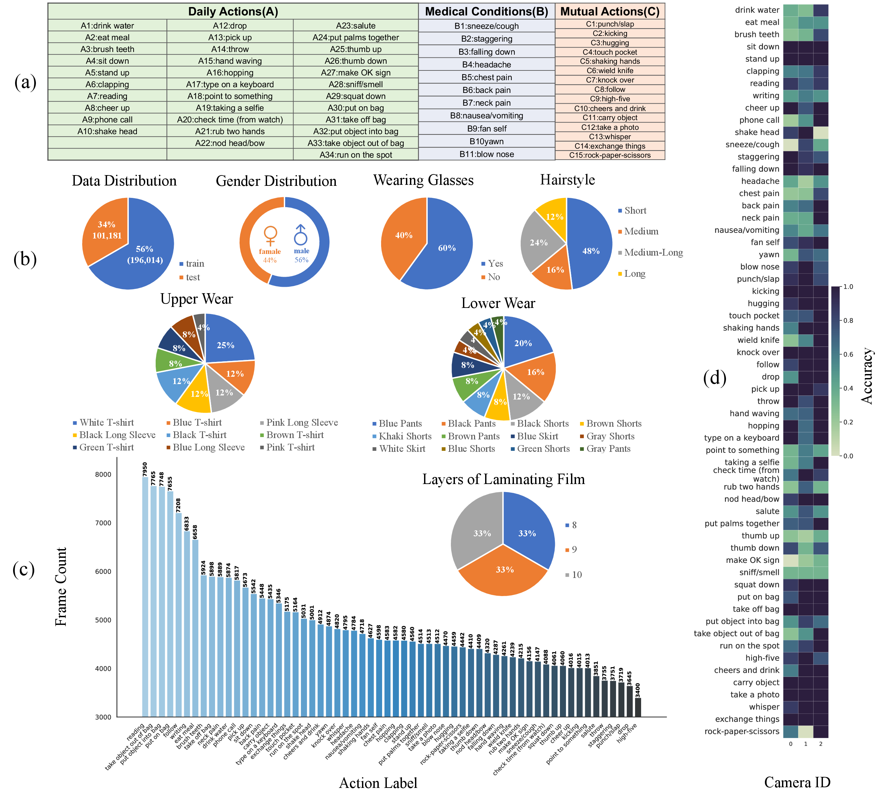

<h1 align="center">Lens Privacy Sealing: A New Benchmark and Method for Physical Privacy-Preserving Action Recognition</h1>

<p align="center">
  <a href="https://scholar.google.com/citations?hl=zh-CN&user=woX_4AcAAAAJ">Mengyuan Liu</a>,
  <a href="https://wangzy01.github.io/">Ziyi Wang</a><sup>&dagger;</sup>,
  <a href="https://scholar.google.com/citations?user=TFBbgIQAAAAJ&hl=zh-CN">Peiming Li</a><sup>&dagger;</sup>,
  <a href="https://scholar.google.com/citations?user=fJ7seq0AAAAJ&hl=zh-CN">Junsong Yuan</a>
</p>

<p align="center">
  Peking University Shenzhen Graduate School, State University of New York at Buffalo
</p>

<h2 align="center">IEEE Transactions on Image Processing (T-IP), 2026</h2>

<p align="center">
  <a href="https://arxiv.org/"><b>[Paper]</b></a>
  |
  <a href="https://github.com/wangzy01/MSPNet"><b>[Code]</b></a>
</p>

<p align="center">
  <sup>&dagger;</sup> Corresponding authors: Ziyi Wang and Peiming Li
</p>

## P3AR-NTU

This repository provides processing scripts and metadata for the P3AR-NTU dataset. The companion MSPNet code repository is available at:

[MSPNet Code Repository](https://github.com/wangzy01/MSPNet)

```text
https://github.com/wangzy01/MSPNet
```

## Dataset Statistics



## Download

Download the P3AR-NTU data from:

```text
https://pan.baidu.com/s/1BcO7uwanPu-1msp7o1gl3Q?pwd=l3tb
Access code: l3tb
```

The original NTU RGB+D 120 dataset should be obtained separately from the official NTU RGB+D release. It is used to recover sample names and frame ranges for alignment.

## Files

- `output_v2.txt`: precomputed mapping from start frame, end frame, and NTU sample name.
- `get_output_txt.py`: extracts sample frame ranges from the original NTU RGB+D 120 videos.
- `get_all_frames.py`: extracts frames from the recaptured raw video stream.
- `folders_for_each_video.py`: organizes extracted frames into one folder per video sample using `output_v2.txt`.
- `split_into_videos.py`: optionally splits the recaptured raw video into individual clips.
- `time.txt`: timing metadata from the original processing.

## Processing Steps

Before running the scripts, update the hard-coded paths in each Python file to match your local dataset locations.

1. Download P3AR-NTU from the link above.
2. Download the original NTU RGB+D 120 dataset separately.
3. If `output_v2.txt` is unavailable or needs to be regenerated, run:

```bash
python get_output_txt.py
```

4. Extract frames from the recaptured raw video stream:

```bash
python get_all_frames.py
```

5. Organize frames into per-sample folders:

```bash
python folders_for_each_video.py
```

6. Optionally split the raw recaptured video into separate video clips:

```bash
python split_into_videos.py
```

## Citation

## Contact

For questions about P3AR-NTU, please contact the corresponding authors:

```text
ziyiwang@stu.pku.edu.cn
lipeiming1001@stu.pku.edu.cn
```

## License

This project is released under the MIT License. See [LICENSE](./LICENSE) for details.
